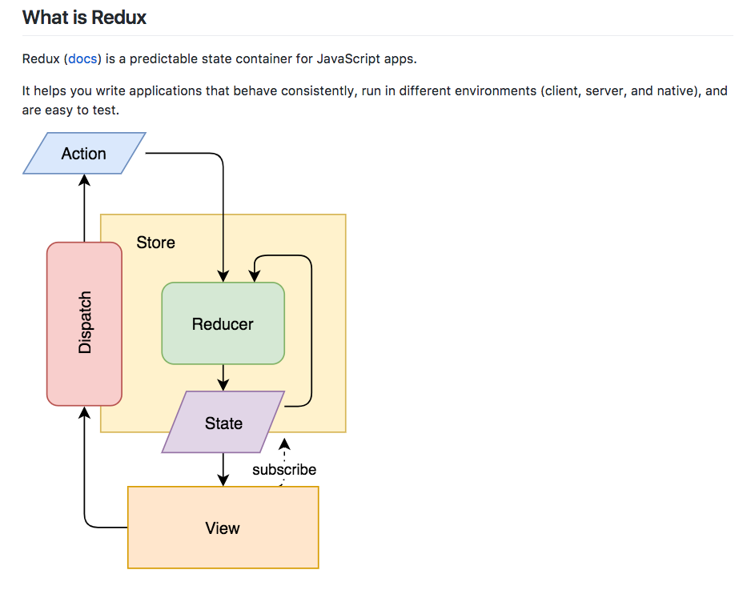
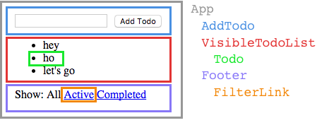

## React-Redux Workshop


This project was bootstrapped with [Create React App](https://github.com/facebookincubator/create-react-app).

Check out this guide [here](https://github.com/facebookincubator/create-react-app/blob/master/packages/react-scripts/template/README.md) to perform common tasks.

The following 30 exercises are based on Dan Abramov's egghead.io [Getting Started with Redux](https://egghead.io/courses/getting-started-with-redux) tutorial. Thank you to [Justin Wu's implementation of the exercises](https://medium.com/@justin3737/getting-started-with-redux-dded45556673) from the egghead.io tutorial above.

## Objective
 

The goal of this workshop is to provide basic working knowledge of React and Redux. The concepts and exercises covered here cover only a subset of the features of these libraries, but this should equip you with:

- fluency in the concepts and syntax used in React/Redux development

- a foundation for advancing your understanding of React/Redux

We will build a simple "Todo List" application using these technologies.

We will writing code using the code templates in this repo as a sandbox for following along with the video lessons.


## Setup local dev environment

You must have the following set up locally:
* [NodeJs](https://nodejs.org/en/)
* [NPM](https://www.npmjs.com/) or [Yarn](https://yarnpkg.com/en/)
* IDE/Editor like [VSCode](https://code.visualstudio.com/)

Clone this repo onto your machine:
```sh
git clone https://github.com/lar248/react-redux-workshop.git
```

Go to your project's root directory:
```sh
cd react-redux-workshop/
```

Install your node dependencies using npm (or yarn):
```sh
npm install
```
or
```sh
yarn
```

Run the following to create symbolic links to allow running npm scripts with dependencies from the project's root directory (only installing dependencies once in root).

##### Mac
```sh
source link-all-lessons-deps.sh
```

##### Windows
```sh
source link-all-lessons-deps.bat
```

## React

### Overview

* Lightweight component rendering library [Tutorial](https://facebook.github.io/react/tutorial/tutorial.html#what-is-react) | [Video](https://www.lynda.com/React-js-tutorials/What-React/519668/542812-4.html)

* Virtual DOM rendering [Virtual Dom](https://www.lynda.com/React-js-tutorials/Why-React-so-fast/519668/542813-4.html) | [More](https://hackernoon.com/virtual-dom-in-reactjs-43a3fdb1d130)

* Technically it is a library and not a framework, however we never use just react ['React' is a framework maybe](http://www.sohamkamani.com/blog/2016/11/16/react-is-a-framework/)
  * [Framework vs Library vs Toolkit vs SDK](https://medium.com/@shashvatshukla/framework-vs-library-vs-platform-vs-api-vs-sdk-vs-toolkits-vs-ide-50a9473999db)

### Concepts
* Intro React docs
  * https://facebook.github.io/react/docs/hello-world.html

  * https://facebook.github.io/react/docs/introducing-jsx.html

  * https://facebook.github.io/react/docs/rendering-elements.html

  * https://facebook.github.io/react/docs/components-and-props.html

* Can describe UI with small composable api: `React.createElement(type, props, children)`

* [JSX](https://facebook.github.io/react/docs/introducing-jsx.html) extends JS with HTML like syntax that so you [don't have to use `createElement`](
https://reactjs.org/docs/react-without-jsx.html)

* JS forces us to use `React.createElement`. Each JSX element is just syntactic sugar for calling React.createElement(component, props, ...children). So, anything you can do with JSX can also be done with just plain JavaScript

* JSX allows expressing UI using familiar HTML syntax, while integrating full power of JS

* [Children with Jsx](https://reactjs.org/docs/jsx-in-depth.html#children-in-jsx)

* React elements are simply lightweight JS objects

* Immutability is important for inexpensive change detection and efficient rendering

* Data flows down via props

* [Embraces composition over inheritance](https://facebook.github.io/react/docs/composition-vs-inheritance.html)

* Relies on many functional paradigms (immutability, functional components, higher-order components)

* [Composition vs Inheritance](https://reactjs.org/docs/composition-vs-inheritance.html)
  * Facebook does not use inheritance and instead uses [components and props](https://reactjs.org/docs/components-and-props.html)
  * Example
    * [Before composibility](https://codepen.io/gaearon/pen/VKQwEo?editors=0010)
    * [After composibility](https://codepen.io/gaearon/pen/rrJNJY?editors=0010)

* Functional paradigms in React:
  * (Immutability](https://reactjs.org/docs/update.html)
  * [Functional components](https://reactjs.org/docs/components-and-props.html)
  * [Higher-order components](https://reactjs.org/docs/higher-order-components.html)

* Classes vs Functions
  * All React components must act like pure functions with respect to their props.
  * [Pure vs Impure functions](https://egghead.io/lessons/react-redux-pure-and-impure-functions)
* How to [think](https://reactjs.org/docs/thinking-in-react.html) in React

 

## Redux
There is a lot more on React than what is above but that should be a good first understanding of React within the context of the Redux egghead course. While React provides a way for components to manage their own state, in this workshop we will be providing state to components via `props`, and letting Redux manage the state.




Redux is a predictable state container for JavaScript apps.

It helps you write applications that behave consistently, run in different environments (client, server, and native), and are easy to test.

 
### Target app


Before building a UI, it's helpful to draw a sketch of the UI and break it into a component hierarchy.

Below is a rendering of the app we will be building, demonstrating how the UI is composed of hierarchy of "components".




For future reference, [Thinking in React][TIR] is a great overview on how to think about composing your UI.

We will build this app using React UI components, and will use Redux to provide the state data into these components.

To run the target app locally, in the terminal, change into the `complete-app` directory and run either `npm start` or `yarn start`.

This will open a browser window to http://localhost:3000/


## Exercises
We will build this app using React UI components, and will use Redux to provide the state data into these components.

### Lessons 1-4
These introductory lessons will give demonstrate some of Redux's most important functionality that will be the building blocks for understanding how its designed and how to effectively use it.

Watch the first 4 videos [here](https://egghead.io/lessons/react-redux-the-single-immutable-state-tree) before we dive into our first exercise in lesson 5. Continue following the lessons in the tutorial series along with the exercises in the lesons below!

### Lesson 5
1. open `lesson-5/index.js` in your IDE
2. in the terminal, change into the above directory
3. follow instructions in the comments there.

### Lesson 6
1. open `lesson-6/index.js` in your IDE
2. in the terminal, change into the the above directory and run `npm start` or `yarn start`;
   this will open a browser window to http://localhost:3000/
3. per the end of the video, complete the code in `index.js` so that it behaves
   as expected in the browser
4. if necessary, see `lesson-6/index-complete` for the solution
5. in the terminal `CTRL+C` to kill the web server

### Lessons 7-8
Follow the same directions for Lesosn 6, using the relevent directory of the target lesson.

### Lessons 9-13
Follow the same directions for Lesosn 5, using the relevent directory of the target lesson.

### Lesons 14-16
No coding exercises included for these lessons

### Lesson 17
Newcomers to React often use [refs](https://reactjs.org/docs/refs-and-the-dom.html) but they can and should be avoided as explained [here](https://stackoverflow.com/questions/29503213/use-state-or-refs-in-react-js-form-components).

Follow the same directions for Lesosn 6, using the relevent directory of the target lesson.

### Lessons 18-19
Follow the same directions for Lesosn 6, using the relevent directory of the target lesson.

### Lessons 20-23
These lessons introduce opportunities to refactor and extract out presentational components so they can be reused, tested, and modified by a collaborative team.

Lesson 22 introduces the [React's Component Lifecycle API](https://reactjs.org/docs/react-component.html). Note that code reuse is primarily achieved through composition rather than inheritance in React so we extend the abstract class 'React.Component' only to subclass it for use of its lifecycle methods like 'render()', 'componentWillMount()', etc... 'Lifecycle methods' can be overriden to trigger certain code blocks at certain times. 

Follow the same directions for Lesosn 6, using the relevent directory of the target lesson.

### Lessons 24-30
We will wrap up the tutorial by leveraging certain bindings (like 'react-redux') that we can import to more elegeantly achieve the same goal we achieved when we were passing props around in earlier exercises. Using the concept of containers as well as 'connect()', and '<Provider>' from 'react-redux', we will leverage all of this so we can build an application that can scale. 

Follow the same directions for Lesosn 6, using the relevent directory of the target lesson.


## Additional Learning

Here are some additional concepts to consider when learning how to build a modern front-end application using React/Redux:
* [Redux vs Alternatives (ie: Flux)](https://stackoverflow.com/questions/32461229/why-use-redux-over-facebook-flux)
* CSS in JS with [Emotion](https://github.com/emotion-js/emotion)
* Handle asynchronous 'threads' in your react-redux app with [redux-sagas](https://github.com/redux-saga/redux-saga)
* [ES5 vs ES6](https://codeburst.io/es5-vs-es6-with-example-code-9901fa0136fc)
* Generate static assets using [Webpack](https://webpack.js.org/) and transpile ES6 into ES5 using [Babel](https://babeljs.io/) - a [tutorial](https://www.valentinog.com/blog/react-webpack-babel/) for combining React with Babel/Webpack
* Chrome Dev tools
  * [React](https://chrome.google.com/webstore/detail/react-developer-tools/fmkadmapgofadopljbjfkapdkoienihi?hl=en)
  * [Redux](https://chrome.google.com/webstore/detail/redux-devtools/lmhkpmbekcpmknklioeibfkpmmfibljd?hl=en)
* [Redux Performance](https://redux.js.org/faq/performance)
* [Immutable data cannot be changed](https://facebook.github.io/immutable-js/) once created, leading to much simpler application development, no defensive copying, and enabling advanced memoization and change detection techniques with simple logic
* [Declarative vs Imperative programming](https://stackoverflow.com/questions/33655534/difference-between-declarative-and-imperative-in-react-js)
* Testing
	* [Jest](https://facebook.github.io/jest/docs/en/tutorial-react.html)
